## 第1章 网络基础

### TCP/IP

通常使用的网络（包括互联网）是在 TCP/IP 协议族的基础上运作的。而 HTTP 属于它内部的一个子集。

TCP/IP 协议族按层次分别分为以下 4 层：**应用层**、**传输层**、**网络层**和**数据链路层**。分层的好处：每个层次内部的设计就能够自由改动，设计也变得相对简单，任务处理简单。

| **应用层**     | 决定了向用户提供应用服务时通信的活动。 TCP/IP 协议族内预存了各类通用的应用服务，比如： + 用户要下载文件 → 用 FTP 协议。 + 用户要访问网页 → 用 HTTP 协议。 + 用户要查域名 → 用 DNS 协议。 |
| :------------- | :---------------------------------------------------------------------------------------------------------------------------------------------------------------------------------------------------------- |
| **传输层**     | 对上层应用层，提供处于网络连接中的两台计算机之间的数据传输。 有两个性质不同的协议：**TCP**（传输控制协议）和 **UDP**（用户数据报协议）。                                                                |
| **网络层**     | 用来处理在网络上流动的**数据包**。数据包是网络传输的最小数据单位。该层规定了通过怎么样的路径到达对方计算机，并把数据包传送给对方。                                                                          |
| **数据链路层** | 用来处理连接网络的**硬件**部分。                                                                                                                                                                            |

### TCP/IP 通信传输流

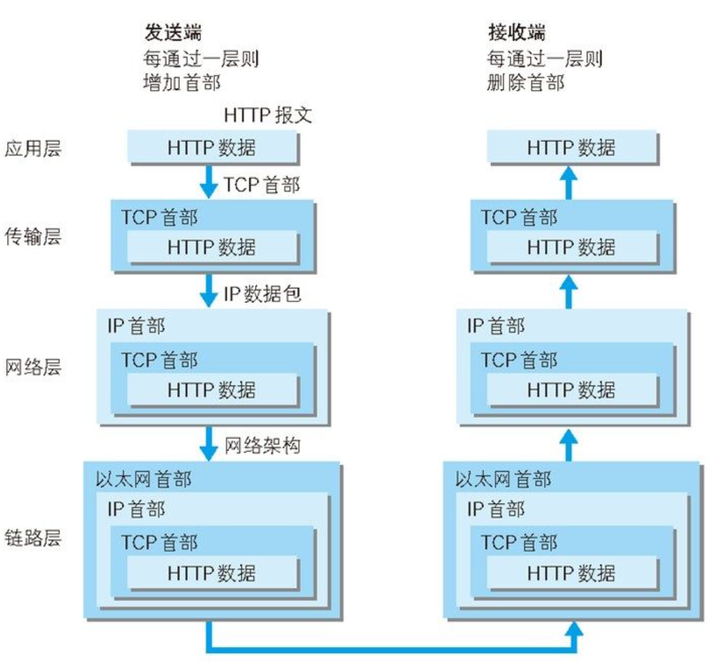

### 与HTTP关系密切的协议：IP、TCP和DNS

#### 负责传输的 IP 协议

IP（网际协议）位于**网络层**。该协议的作用是把各种**数据包**传送给对方。而要保证确实传送到对方那里，则需要满足各类条件。其中最重要的两个条件是 **IP 地址（节点被分配到的地址，可变）** 和 **MAC地址（网卡所属的固定地址，永久唯一）**。IP地址可以和MAC地址进行配对。

**使用ARP协议凭借MAC地址进行通信：**

在局域网中，为了把网络层的 IP 地址映射到数据链路层的 MAC 地址，需要用 **ARP 协议。** 该协议是一种用以解析地址的协议，根据通信方的IP地址就可以反查出对应的MAC地址。

#### 确保可靠性的TCP协议

TCP属于**传输层**，提供可靠的**字节流服务**。 字节流服务是指：为了方便传输，将大块数据**分割成以报文段为单位**的**数据包**进行管理。 这就是为什么下载高清大图时，图片会一块一块地加载。

**三次握手** 为了准确无误地将数据送达目标处，TCP协议在发送数据的准备阶段采用了**三次握手策略**（若在握手过程中某个阶段中断，TCP协议会再次以相同的顺序发送相同的数据包）。**SYN**、**ACK**

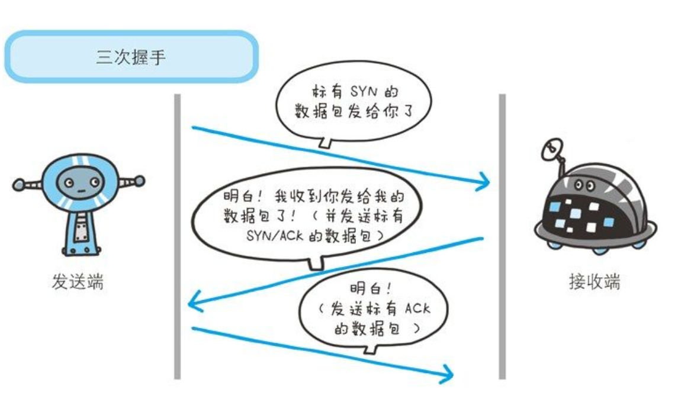

#### 负责域名解析的 DNS 服务

DNS位于**应用层**。提供域名到IP 地址之间的解析服务。 即可通过域名查找IP，或逆向从IP地址反查域名服务。ip不符合记忆习惯，所以需要域名。

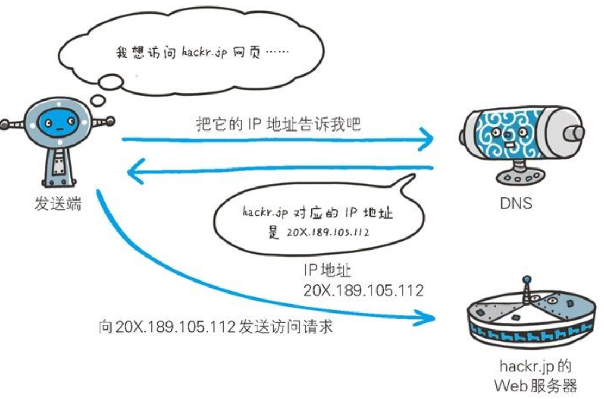

#### 过程

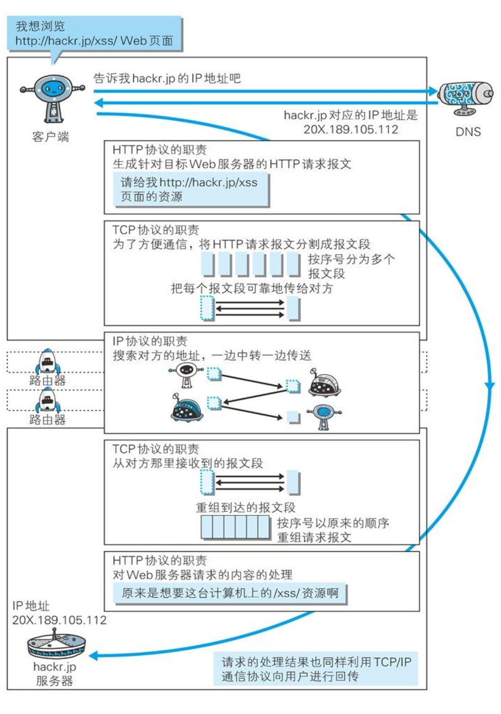

#### URI和URL

URL是URI的子集

- **URI = 标识符**，标记资源
- **URL = 定位符**，标记资源的位置，方便访问

## 第2章 HTTP 协议

### HTTP 协议用于客户端和服务器之间的通信。

### 通过请求和响应的交换达成通信

请求报文的构成：

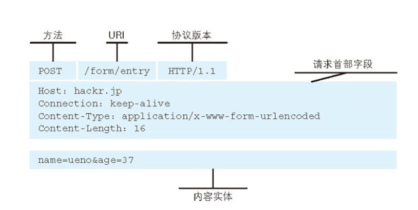

**响应报文的构成：**

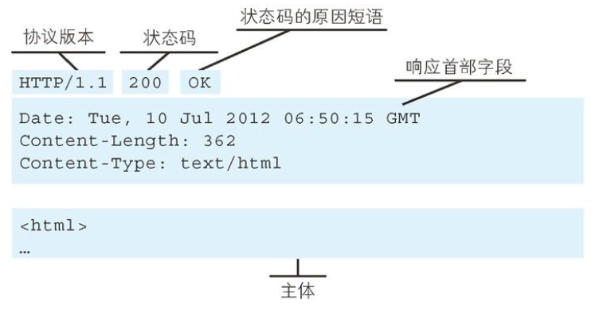

### HTTP是不保存状态的协议

HTTP是**无状态协议**。
自身不对请求和响应之间通信状态进行保存（即不做持久化处理）。 HTTP之所以设计得如此简单，是为了更快地处理大量事物，确保协议的可伸缩性。 HTTP/1.1 随时无状态协议，但可通过 Cookie 技术保存状态。

### 告知服务器意图的HTTP方法

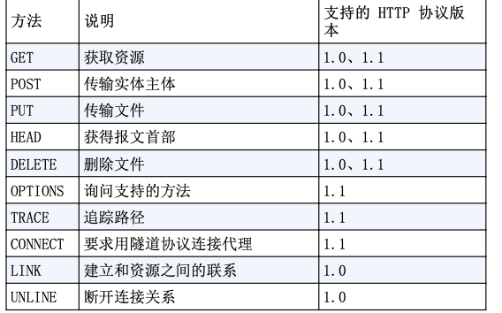

### 持久连接

HTTP 协议的初始版本中，每进行一次 HTTP 通信就要断开一次 TCP 连接。发送请求一份包含多张图片的HTML文档对应的Web页面，会产生大量通信开销。

为了解决上述TCP连接的问题，HTTP/1.1和一部分的HTTP/1.0想出了**持久连接**（ 也称为HTTP keep-alive）的方法。
**持久连接的特点**是，只要任意一端没有明确提出断开连接，则**保持TCP连接状态**。

**持久连接的好处**在于**减少**了TCP连接的重复建立和断开所造成的**额外开销**，减轻了服务器端的**负载**。

### 管线化

同时并行发送多个请求

### 使用Cookie的状态管理

Cookie技术通过在请求和响应报文中写入cookie信息来控制客户端的状态。 Cookie会根据从服务器端发送的响应报文内的一个叫做 `Set-Cookie` 的首部字段信息，通知客户端保存 Cookie。当下次客户端再往该服务器发送请求时，客户端会自动在请求报文中加入Cookie值后发送出去。

## 第3章 HTTP报文内的HTTP信息

### HTTP报文

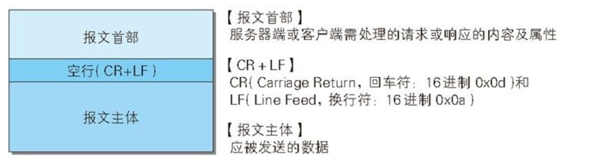

HTTP 报文分为**请求报文**和**响应报文**，基本结构一致。

**报文组成部分**

1. **报文首部**：
   - **请求行 / 状态行**
   - **首部字段**：包含通用首部、请求首部、实体首部等。
   - **其他**：可能包含 RFC 未定义的 Cookie 等内容。
2. **空行 (CR+LF)**：用于分隔首部与主体。
3. **报文主体**：包含发送的具体数据（可选）。

- **请求行**：包含方法（GET/POST）、URI、HTTP 版本。
- **状态行**：包含 HTTP 版本、状态码、原因短语。

### 编码提升传输速率

HTTP在传输数据时可以按照数据原貌直接传输，但也可以在传输过程中通过编码提升传输速率，但这会消耗更多的CPU等资源。

#### 报文主体和实体主体的差异

报文：是HTTP通信中的基本单位，由8位组字节流组成，通过HTTP通信传输。 实体：作为请求或响应的有效载荷数据（补充项）被传输，其内容由实体首部和实体主体组成。

HTTP报文的主体用于传输请求或响应的实体主体。 通常，报文主体等于实体主体。只有当传输中进行编码操作时，实体主体的内容发生变化，才导致它和报文主体产生差异。

#### 压缩传输的内容编码

内容编码指明应用在实体内容上的编码格式，并保持实体信息原样压缩。内容编码后的实体由客户端接收并负责解码。 常见的内容编码有：gzip（GNU zip）、compress（UNIX系统的标准压缩）、deflate（zlib）、identity（不进行编码）

#### 分隔发送的分块传输编码

在HTTP通信过程中，请求的编码实体资源尚未全部传输完成之前，浏览器无法显示请求页面。在传输大容量数据时，通过把数据分割成多块，能够让浏览器逐步显示页面。 这种把实体主体分块的功能称为**分块传输编码**（Chunked Transfer Coding）。

分块传输编码会将实体主体分成多个部分（块）。每一块都会用十六进制来标记块的大小，而实体主体的最后一块会使用“0（CR+LF）”来标记。

使用分块传输编码的实体主体会由接收的客户端负责解码，恢复到编码前的实体主体。

#### 发送多种数据的多部分对象集合

HTTP协议中采纳了多部分对象集合，发送的一份报文主体内可含有多类型实体。通常是在图片或文本文件等上传时使用。

#### 获取部分内容的范围请求

下载大尺寸的图片的过程中，如果网络中断，则需要重新下载。因此需要一种可恢复的机制。 实现该功能需要指定下载的实体范围，像这样，指定范围发送的请求叫做**范围请求**。 执行范围请求时，会用到首部字段Range来指定资源的byte范围。响应会返回状态码206 Partial Content。

如果服务器端无法响应范围请求，则会返回状态码200 OK和完整的实体内容。

#### 内容协商返回最合适的内容（多语言）

内容协商机制是指客户端和服务器端就响应的资源内容进行交涉，然后提供给客户端最为适合的资源。内容协商会以响应资源的语言、字符集、编码方式等作为判断的基准。

## 第4章 返回结果的HTTP状态码

**HTTP 状态码**负责表示客户端 HTTP 请求的**返回结果**、标记服务器端的处理是否正常、通知出现的错误等工作。

**响应类别**

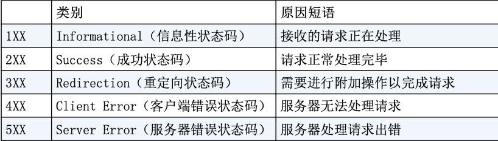

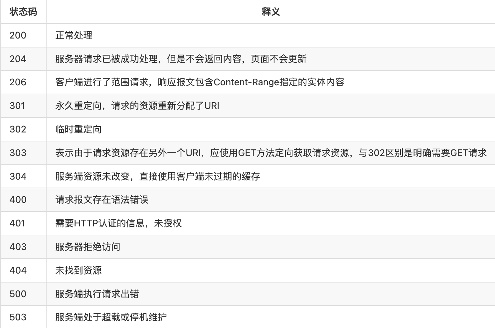

## 第5章 与HTTP协作的Web服务器

### 用单台虚拟主机实现多个域名

HTTP/1.1 规范允许一台HTTP服务器搭建多个Web站点。这是利用虚拟主机的功能。

在互联网上，域名通过DNS服务映射到IP地址之后访问目标网站。可见，当请求发送到服务器时，已经是以IP地址形式访问了。所以，当一台托管了两个域名的服务器接收到请求时就需要弄清楚究竟要访问哪个域名。在相同的IP地址下，由于虚拟主机可以寄存多个不同主机名和域名的Web网站，因此在发送HTTP请求时，必须在Host首部内完整指定主机名或域名的URI。

### 通信数据转发程序：代理、网关、隧道

HTTP通信时，除客户端和服务器以外，还有一些用于通信数据转发的应用程序，例如代理、网关、隧道。它们可以配合服务器工作。

**代理**：是一种有转发功能的应用程序，接收由客户端发送的请求并转发给服务器，同时也接收服务器返回的响应并转发给客户端。

使用代理服务器的理由有：利用缓存减少网络带宽流量，内部针对特定网站的访问控制。代理有多种使用方法，按两种基准分类：

- **缓存代理**：代理转发请求响应时，缓存代理会预先将资源副本保存在代理服务器上。
- **透明代理**：转发请求或者响应时，不对报文做加工的代理类型称为透明代理，对报文加工的称为非透明代理。

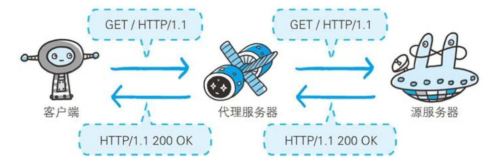

**网关**：是转发其他服务器通信数据的服务器，工作机制和代理十分相似。而网关能使通信线路上的服务器提供**非HTTP协议服务**。利用网关能提高通信的安全性，因为可以在客户端与网关之间的通信线路上加密以确保连接的安全。比如，网关可以连接数据库，使用SQL语句查询数据。另外，在Web购物网站上进行信用卡结算时，网关可以和信用卡结算系统联动。

**隧道**：是在相隔甚远的客户端和服务器两者之间进行中转，并保持双方通信连接的应用程序。

隧道可按要求建立起一条与其他服务器的**通信线路**，届时使用SSL等加密手段进行通信。隧道的目的是确保客户端能与服务器进行**安全**的通信。

隧道本身不会去解析HTTP请求。也就是说，请求保持原样中转给之后的服务器。隧道会在通信双方断开连接时结束。

### 保存资源的缓存

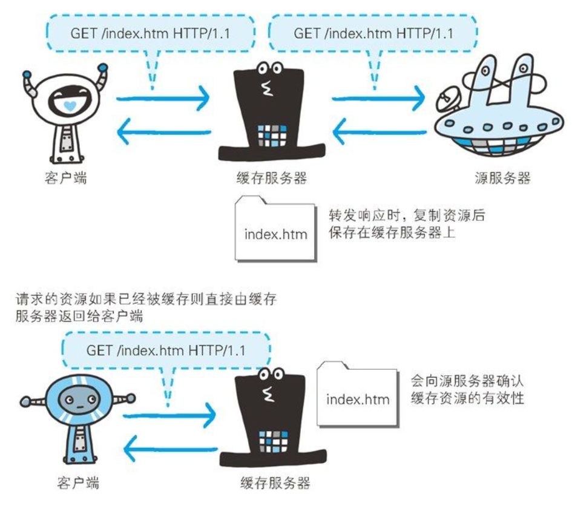

缓存是指代理服务器或客户端本地磁盘内保存的资源副本。利用缓存可减少对源服务器的访问，节省通信流量和时间。

缓存服务器是代理服务器的一种。当代理转发从服务器返回的响应时，代理服务器将会保存一份资源的副本。

缓存服务器的优势在于利用缓存可避免多次从源服务器转发资源。因此客户端可就近从缓存服务器上获取资源，而源服务器也不必多次处理相同的请求了。

### 缓存的有效期限

**客户端缓存解决“减少请求”，服务器缓存解决“减少计算”。**

当判定缓存过期或客户端要求，会向源服务器确认资源的有效性。若失效，浏览器会再次请求新资源。

客户端缓存：浏览器缓存有效，就不会向服务器请求相同资源，可以直接从本地磁盘读取。

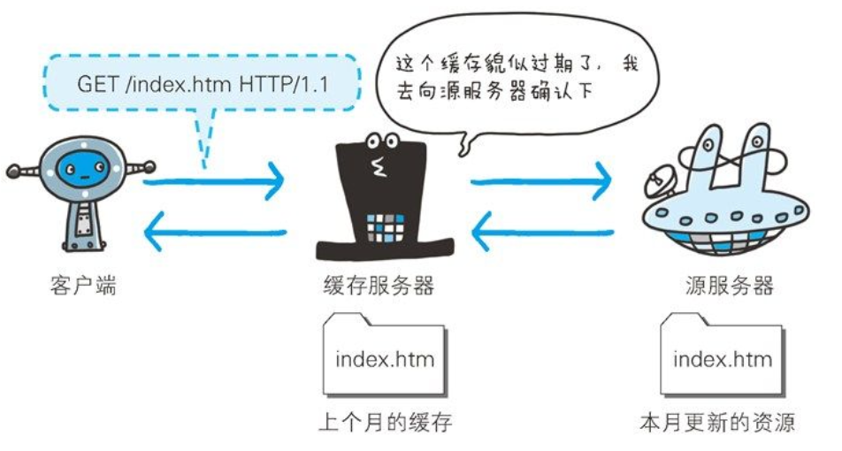

## 第6章 HTTP首部

### HTTP报文首部

HTTP协议的请求和响应报文中必定包含HTTP首部。
首部内容为客户端和服务器端分别处理请求和响应提供所需要的信息。

HTTP请求报文：由**方法、URI、HTTP版本、HTTP首部字段**等构成。

HTTP响应报文：由**HTTP版本、状态码（数字和原因短语）、HTTP首部字段** 3 部分组成。

### HTTP首部字段

HTTP 首部字段是构成 HTTP 报文的要素之一。在客户端与服务器之间以 HTTP 协议进行通信的过程中，无论是请求还是响应都会使用首部字段，它能起到传递额外重要信息的作用。

使用首部字段是为了给浏览器和服务器提供报文主体大小、所使用的语言、认证信息等内容。

HTTP 首部字段将定义成缓存代理和非缓存代理的行为，分成 2 种类型：**端到端首部、逐跳首部**。

### 4种HTTP首部字段类型

- **通用首部**：请求和响应都会用的属性。
- **请求首部**：补充请求的附加信息。
- **响应首部**：补充响应的附加信息。
- **实体首部**：针对报文主体内容的补充。

### HTTP/1.1首部字段一览

#### 通用首部字段

| 首部字段名        | 说明                                                                             | 例子                                                                                                                                                                                                                                                                                                                                                                                                                                                                                                                                                                                                                                                                                                                                                                                                                                                                                                                                                                                                 |
| ----------------- | -------------------------------------------------------------------------------- | ---------------------------------------------------------------------------------------------------------------------------------------------------------------------------------------------------------------------------------------------------------------------------------------------------------------------------------------------------------------------------------------------------------------------------------------------------------------------------------------------------------------------------------------------------------------------------------------------------------------------------------------------------------------------------------------------------------------------------------------------------------------------------------------------------------------------------------------------------------------------------------------------------------------------------------------------------------------------------------------------------- |
| Cache-Control     | 控制缓存行为                                                                     | `Cache-Control: public, max-age=31536000` (缓存一年)  **public**：**响应**可被浏览器及任何中间代理（CDN）缓存。 **private**：**响应**仅限浏览器缓存，**中间代理禁止缓存**（保护隐私）。 **no-cache**：**语义陷阱**。可以缓存，但使用前必须验证。`=xxx` 是指定只针对某些首部不能直接使用缓存值。 **no-store**：完全不缓存。 **max-age**：**最常用**。设置资源最大生命周期（秒）。 **s-maxage=xx**：仅用于 **CDN/代理服务器**，优先级高于max-age。 **min-fresh**：要求缓存服务器返回至少还未过指定时间的缓存资源。 **max-stale**：未指定参数值，无论经过多久，客户端都会接收响应；如果指定了具体数值，即使过期只要仍处于 max-stale 指定的时间内，仍旧会被客户端接收。 **only-if-cached**：只要缓存。如果缓存没有，直接返回 504，不准去源站。 **must-revalidate**：资源一旦过期，必须回源验证，禁止使用陈旧缓存。 **proxy-revalidate**：要求中间代理服务器在返回缓存前必须先验证是否有效。 **no-transform**：禁止代理服务器压缩图片或修改媒体类型。 |
| Connection        | 控制是否保持长连接，或禁止代理转发某些字段                                       | 1. 控制不再转发的首部 (Hop-by-hop) + **逻辑**：客户端通过 `Connection: [字段名]` 告诉代理服务器，在把请求转交给源服务器之前，必须把指定的这个字段删掉。 + **场景**：如 `Connection: Upgrade`，代理服务器处理完协议升级后，不会将其透传给下游。  2. 管理持久连接 (Keep-Alive) + **Keep-Alive (长连接)**：  - **HTTP/1.1 默认开启**。  - **作用**：TCP 连接在请求完成后不立即关闭，后续请求复用同一通道，减少握手开销。  - **响应示例**：`Keep-Alive: timeout=10, max=500` (保持 10 秒，最多复用 500 次)。 + **Close (短连接)**：  - **作用**：显式告知对方，本次响应结束后立即断开 TCP 连接。                                                                                                                                                                                                                                                                                                                                                                 |
| Date              | 创建报文的日期时间                                                               | `Date: Tue, 03 Jul 2012 04:40:59 GMT`                                                                                                                                                                                                                                                                                                                                                                                                                                                                                                                                                                                                                                                                                                                                                                                                                                                                                                                                                                |
| Pragma            | 报文指令（历史遗留字段，主要用于向后兼容）                                       | HTTP/1.1 之前的历史遗留字段，仅用于向后兼容（兼容 HTTP/1.0）。 **唯一形式**：`Pragma: no-cache`。 **功能**：要求中间服务器（代理）不返回缓存资源，必须转发请求给源服务器。 **现代用法**：为了确保在所有版本的代理服务器上都不使用缓存，通常会同时发送：`Cache-Control: no-cache` 和 `Pragma: no-cache`。                                                                                                                                                                                                                                                                                                                                                                                                                                                                                                                                                                                                                                                                                 |
| Trailer           | 报文末端的首部一览。用于指示在分块传输编码的报文主体之后，还会出现哪些首部字段。 | `Trailer: Content-MD5` <-- 预告：结尾会有这个字段                                                                                                                                                                                                                                                                                                                                                                                                                                                                                                                                                                                                                                                                                                                                                                                                                                                                                                                                                    |
| Transfer-Encoding | 指定报文主体的传输编码方式                                                       | 规定了传输报文主体时采用的编码方式`chunked`（分块传输）                                                                                                                                                                                                                                                                                                                                                                                                                                                                                                                                                                                                                                                                                                                                                                                                                                                                                                                                              |
| Upgrade           | 升级为其他协议                                                                   | `Connection: Upgrade` `Upgrade: websocket`                                                                                                                                                                                                                                                                                                                                                                                                                                                                                                                                                                                                                                                                                                                                                                                                                                                                                                                                                       |
| Via               | 代理服务器的相关信息                                                             | `Via: cache31.l2cn2636[34,0], vcache10.cn2544[62,200]`                                                                                                                                                                                                                                                                                                                                                                                                                                                                                                                                                                                                                                                                                                                                                                                                                                                                                                                                               |
| Warning           | 错误通知（新版弃用）                                                             |                                                                                                                                                                                                                                                                                                                                                                                                                                                                                                                                                                                                                                                                                                                                                                                                                                                                                                                                                                                                      |

### 补充说明

#### Cache-Control (缓存控制)

- **场景：强缓存策略** 在打包部署时，静态资源（JS/CSS）文件名带有哈希值（`index.d4f1a.js`），我们可以放心让浏览器缓存很久：
  - **响应头：**`Cache-Control: public, max-age=31536000` (缓存一年)
- **场景：协商缓存（配合 ETag）** 对于 `index.html`，文件名不变，但内容经常变，我们需要每次都问服务器：
  - **响应头：**`Cache-Control: no-cache` (意为使用前必须先去服务器验证)而不是不缓存。`no-store`才是真正不进行缓存。
- **HTML 页面**：`no-cache`（保证逻辑实时更新）。
- **静态资源 (JS/CSS)**：`public, max-age=31536000`（带 Hash 后缀，利用强缓存）。
- **敏感接口 (API)**：`no-store`（防止敏感数据残留在浏览器）。

#### Upgrade (协议升级)

- **场景**：建立 WebSocket 连接。当你实现一个实时聊天功能时，前端发送的第一个握手请求会包含：
  - 请求头：`Connection: Upgrade` 和 `Upgrade: websocket`
  - **作用**：询问服务器：“咱们能不能别用 HTTP 聊了，升级到 WebSocket 协议来实时通信？”仅限和代理服务器之间的通信，完事就删掉。

#### Via (代理路径)

- **场景**：CDN 或 负载均衡。如果你使用了阿里云 CDN 或 Nginx 转发，查看响应头经常能看到：
  - 响应头：`Via: cache31.l2cn2636[34,0], vcache10.cn2544[62,200]`
  - **作用**：这告诉你请求经过了哪些缓存节点，方便开发者排查“为什么我更新了代码但用户看到的还是旧版”的问题。

### 补充问答

**问：为什么 HTTP/1.1 必须带 Host？**

**答**：因为物理服务器的 IP 是一对多的。没有 Host，服务器不知道该把请求交给哪个虚拟站点。

**问：Connection: keep-alive 的好处？**

**答**：减少了 TCP 三次握手和四次挥手的频率，降低延迟。

**为什么 Connection: Upgrade 要“清理”？**

清理是为了确保“谁发出的指令，谁负责处理；处理完就抹掉，不给下一站添乱”。

#### 请求首部字段

从客户端往服务器端发送请求报文中所使用的字段，用于补充请求的附加信息、客户端信息、对响应内容相关的优先级等内容。

| 首部字段名          | 说明                                                                                                                 | 例子                                                                                                                                                                                                                                                                                                                                                                                       |
| ------------------- | -------------------------------------------------------------------------------------------------------------------- | ------------------------------------------------------------------------------------------------------------------------------------------------------------------------------------------------------------------------------------------------------------------------------------------------------------------------------------------------------------------------------------------ |
| Accept              | 浏览器可接受的媒体类型                                                                                               | `Accept: text/html,application/xhtml+xml` 权重值q 的范围是 0~1（可精确到小数点后 3 位），且 1 为最大值。                                                                                                                                                                                                                                                                                   |
| Accept-Charset      | 支持的字符集及优先顺序                                                                                               | `Accept-Charset: utf-8`                                                                                                                                                                                                                                                                                                                                                                    |
| Accept-Encoding     | 支持的内容编码及优先顺序                                                                                             | `Accept-Encoding: gzip, br`                                                                                                                                                                                                                                                                                                                                                                |
| Accept-Language     | 支持的语言及优先顺序                                                                                                 | `Accept-Language: zh-CN,zh;q=0.9`                                                                                                                                                                                                                                                                                                                                                          |
| Authorization       | Web认证信息                                                                                                          | `Bearer <token>`                                                                                                                                                                                                                                                                                                                                                                           |
| Expect              | 期待服务器的行为                                                                                                     | **客户端发请求头**：包含 `Expect: 100-continue`，但不发 Body（报文主体）。 **服务器响应**： **愿意接收**：返回 **100 Continue** 状态码，客户端接着发剩下的 Body。 **不愿意/拒绝**：返回 **417 Expectation Failed**（例如因为文件太大、权限不足等）。                                                                                                                           |
| From                | 告知服务器发送请求的用户代理所属用户的电子邮件地址                                                                   | `From: webmaster@example.com`。 + **场景**：现代浏览器出于隐私保护，几乎从不发送这个字段。它现在主要由**网络爬虫**（如 Googlebot）使用。 + **目的**：如果爬虫在抓取网页时由于请求过于频繁导致服务器出现问题，网站管理员可以通过这个邮箱联系爬虫的负责人。                                                                                                                          |
| Host                | 请求资源所在服务器                                                                                                   | 在**HTTP/2 和 HTTP/3** 中，为了统一首部格式，字段名改为了以冒号开头的 **`:authority`** `ali-global-statics.hellotalk8.com` + **场景**：这是 **HTTP/1.1 唯一强制要求**必须包含的字段。 + **目的**：**虚拟主机技术**。由于一个 IP 地址可能托管了多个网站，服务器必须通过 `Host` 字段来判断你到底想访问哪一个域名的资源。如果请求头里没有这个字段，服务器会返回 **400 Bad Request**。 |
| If-Match            | 比较实体标记（ETag）；服务器接收到附带条件的请求后，只有判断指定条件为真时，才会执行请求。并发控制：防止“丢失更新” | 服务器会比对 If-Match 的字段值和资源的 ETag 值，仅当两者一致时，才会执行请求。反之，则返回状态码 412 Precondition Failed 的响应。用于确保你修改的是你“以为”的那个版本。想修改它，发送`PUT` 请求，带上 `If-Match: "v1"` 再对比。                                                                                                                                                          |
| If-None-Match       | 比较实体标记（ETag）； **最常用：协商缓存。** 当浏览器本地有缓存，但不确定是否过期时，会发送这个字段。           | 浏览器发请求带上`If-None-Match: "cndQaJ3l..."`。如果服务器发现文件没变（ETag 没变），就返回 **304**，不传数据。                                                                                                                                                                                                                                                                            |
| If-Modified-Since   | 比较资源的更新时间                                                                                                   | 在 If-Modified-Since 字段值的日期时间之后，如果请求的资源都没有过更新，则返回状态码 304 Not Modified 的响应，否则发起请求。                                                                                                                                                                                                                                                                |
| If-Unmodified-Since | 比较资源的更新时间（与If-Modified-Since相反）                                                                        | 用于条件更新。如果资源在指定时间之后被修改，服务器会返回 412 Precondition Failed，避免并发更新导致的数据覆盖问题。                                                                                                                                                                                                                                                                         |
| If-Range            | 如果文件没变，请把剩下的部分发给我；如果文件变了，干脆把整个最新的发给我。                                           | 校验+下载的合体，一次请求搞定：**没变就续传，变了就重传**。                                                                                                                                                                                                                                                                                                                              |
| Max-Forwards        | 最大传输逐跳数                                                                                                       | 通过 TRACE 方法或 OPTIONS 方法，发送包含首部字段 Max-Forwards 的请求时，该字段以十进制整数形式指定可经过的服务器最大数目。服务器在往下一个服务器转发请求之前，Max-Forwards 的值减 1 后重新赋值。当服务器接收到 Max-Forwards 值为 0 的请求时，则不再进行转发，而是直接返回响应。                                                                                                            |
| Proxy-Authorization | 代理服务器要求客户端的认证信息                                                                                       | `**Authorization**`：给**源服务器**看的（证明你是知乎用户）。 `**Proxy-Authorization**`：给**中转代理**看的（证明你有权使用这个代理上网）。为了安全和计费。确保只有授权用户才能通过该代理节点访问外网。                                                                                                                                                                                |
| Range               | 实体的字节范围请求                                                                                                   | `Range: bytes=0-499`                                                                                                                                                                                                                                                                                                                                                                       |
| Referer             | 当前请求的来源 URI                                                                                                   |                                                                                                                                                                                                                                                                                                                                                                                            |
| TE                  | 支持的传输编码及优先顺序                                                                                             | 客户端声明支持哪些 Transfer-Encoding（如 chunked、trailers）的请求头。                                                                                                                                                                                                                                                                                                                     |
| User-Agent          | HTTP客户端程序的信息                                                                                                 | `User-Agent: Mozilla/5.0 (Windows NT 6.1; WOW64; rv:13.0) Gecko/20100101 Firefox/13.0.1` 首部字段 User-Agent 会将创建请求的浏览器和用户代理名称等信息传达给服务器。                                                                                                                                                                                                                    |

### 补充说明：If-Modified-Since 和 Last-Modified

在一次成功的协商缓存流程中：

**第一次请求**：服务器返回 **Last-Modified（响应头）** `Last-Modified: Wed, 11 Mar 2026 06:00:00 GMT`。

**第二次请求**：浏览器自动把上面那个时间填入 **If-Modified-Since（请求头）** `If-Modified-Since: Wed, 11 Mar 2026 06:00:00 GMT`。

**为什么你会觉得它们可能“不一样”？**

- **时间戳完全匹配**：服务器对比发现 `If-Modified-Since` 的时间等于服务器上文件的最后修改时间。 **结果**：返回 304 Not Modified，不传数据，省流量。
- **服务器端文件更新了**：比如服务器上的文件在 07:00 变了。此时服务器发现它的 `Last-Modified` 是 07:00，而你发来的是 06:00。 **结果**：不一样了！服务器返回 200 OK，并附带全新的文件和新的 `Last-Modified`（07:00）。

**既然有了这对搭档，为什么后来又发明了 ETag？**

- **精度不够**：它只能精确到秒。如果你 1 秒内改了两次文件，它发现不了变化。
- **"伪修改"**：如果你打开了文件又原样保存，修改时间变了，但内容没变。这对搭档会"笨笨地"重新传输整个文件。
- **时间误差**：如果服务器和客户端时间没对准，可能会导致判断失误。

**问：401 和 407 状态码有什么区别？**

**答**：**401** 是源服务器要求认证；**407** 是代理服务器要求认证。

---

#### 响应首部字段

| 首部字段名         | 说明                                         | 例子                                                                                                                           |
| ------------------ | -------------------------------------------- | ------------------------------------------------------------------------------------------------------------------------------ |
| Accept-Ranges      | 是否接受字节范围请求                         | 可指定的字段值有两种，可处理范围请求时指定其为 bytes，反之则指定其为 none。                                                    |
| Age                | 推算资源创建经过时间                         | `Age: 600` 首部字段 Age 能告知客户端，源服务器在多久前创建了响应。字段值的单位为秒。                                       |
| ETag               | 资源的匹配信息，唯一性标识                   | ETag 中有强 ETag 值和弱 ETag 值之分，通过 W/ 区分。                                                                            |
| Location           | 强制浏览器跳转到指定的 URI                   | 配合**301** 或 **302** 状态码使用。当用户访问你的旧域名时，服务器返回 `Location: https://new-domain.com`，浏览器会自动跳转。   |
| Proxy-Authenticate | 代理服务器对客户端的认证信息                 | 当公司内部网络要求通过代理上网时，代理服务器会发送此字段。                                                                     |
| Retry-After        | 对再次发起请求的时机要求                     | 返回`Retry-After: 120`。告知前端脚本 120 秒后再尝试请求。                                                                      |
| Server             | HTTP服务器的安装信息                         |                                                                                                                                |
| Vary               | 代理服务器缓存的管理信息                     | `Vary: Accept-Encoding`。这意味着如果两个请求的压缩方式（如 gzip 和 br）不同，缓存服务器必须为它们分别缓存两个版本，不能混用。 |
| WWW-Authenticate   | 服务器告知客户端需要哪种认证方式才能访问资源 | 配合**401 Unauthorized** 状态码返回，通常包含认证方案（如 Basic 或 Digest）。                                                  |

几乎所有浏览器在接收到包含首部字段Location的响应后，都会强制性地尝试对已提示的重定向资源的访问。

#### 实体首部字段

包含在请求报文和响应报文中的实体部分所使用的首部，用于补充内容的更新时间等与实体相关的信息。

| 首部字段名       | 说明                   | 补充说明                                                                                                                                                                   |
| ---------------- | ---------------------- | -------------------------------------------------------------------------------------------------------------------------------------------------------------------------- |
| Allow            | 资源可支持的HTTP方法   | `Allow: GET, HEAD`                                                                                                                                                         |
| Content-Encoding | 实体主体适用的编码方式 |                                                                                                                                                                            |
| Content-Language | 实体主体的自然语言     |                                                                                                                                                                            |
| Content-Length   | 实体主体的大小（字节） |                                                                                                                                                                            |
| Content-Location | 替代对应资源的URI      |                                                                                                                                                                            |
| Content-MD5      | 实体主体的报文摘要     | 用于**完整性校验**，确保数据在传输过程中没有被篡改或丢失。                                                                                                                 |
| Content-Range    | 实体主体的位置范围     | 告知客户端当前发送的是实体的**哪一部分范围**。 **例子**：`Content-Range: bytes 0-499/1234`。 配合 `206 Partial Content` 状态码，用于**断点续传**或视频分段加载。 |
| Content-Type     | 实体主体的媒体类型     |                                                                                                                                                                            |
| Expires          | 实体主体过期的日期时间 |                                                                                                                                                                            |
| Last-Modified    | 资源的最后修改日期时间 |                                                                                                                                                                            |

### 补充说明：Expires vs Cache-Control

**"有了 Expires 为什么还要 Cache-Control？"**

**答案**：`Expires` 使用的是**绝对时间**，依赖客户端时钟。如果用户电脑时间不准，缓存就会乱套。而 `Cache-Control: max-age=...` 使用的是**相对时间**（比如 3600 秒后过期），更加可靠。

---

#### 为Cookie服务的首部字段

| 首部字段名 | 说明                           | 首部类型                                                                                                                                       |
| ---------- | ------------------------------ | ---------------------------------------------------------------------------------------------------------------------------------------------- |
| Set-Cookie | 开始状态管理所使用的Cookie信息 | 响应首部字段。当服务器想要在你的浏览器里存点数据（比如登录令牌、用户偏好）时使用。 `Set-Cookie: session_id=abc123; HttpOnly; Max-Age=3600` |
| Cookie     | 服务器接收到的Cookie信息       | 请求首部字段。浏览器在之后访问**同一个域名**的服务器时，会自动带上之前存下的信息。                                                             |

### Set-Cookie字段的属性

| 属性         | 说明                                                                                                                                                                                                                                |
| ------------ | ----------------------------------------------------------------------------------------------------------------------------------------------------------------------------------------------------------------------------------- |
| NAME=VALUE   | 赋予Cookie的名称和其值（唯一必需项）。                                                                                                                                                                                              |
| expires=DATE | Cookie的有效期（若不明确指定则默认为浏览器关闭前为止）。                                                                                                                                                                            |
| path=Path    | 限制 Cookie 在域名的哪些路径下有效。 **例子**：设为 `/v1`，则只有路径以 `/v1` 开头的请求会带上此 Cookie。                                                                                                                       |
| domain=域名  | 作为Cookie适用对象的域名（若不指定则默认为创建Cookie的服务器的域名）。                                                                                                                                                              |
| Secure       | 强制要求 Cookie 只能通过**HTTPS** 协议发送。 **目的**：防止 Cookie 在不加密的 HTTP 通信中被中间人监听截获。                                                                                                                     |
| HttpOnly     | 加以限制，使Cookie不能被JavaScript脚本访问。前端 JS 无法通过`document.cookie` 读取，防止 XSS 攻击劫持 Cookie。                                                                                                                      |
| Max-Age      | 设置 Cookie 失效前的**相对时间**（秒数）。 `Max-Age` 的优先级高于 `expires`。它能避免客户端与服务器时间不一致导致的问题。                                                                                                       |
| SameSite     | 限制第三方网站请求时是否携带 Cookie。 **选项**：`Strict`（完全禁止第三方携带）、`Lax`（默认，仅允许部分安全导航携带）、`None`（允许跨站发送，但必须开启 `Secure`）。 **目的**：主要用于防御 **CSRF（跨站请求伪造）** 攻击。 |

### Cookie补充说明

- **expires**：一旦Cookie从服务器端发送至客户端，服务器端就不存在可以显示删除Cookie的方法。但可通过覆盖已过期的Cookie，实现对客户端Cookie的实质性删除操作。
- **大小限制**：单个 Cookie 一般不能超过 **4KB**，每个域名下的 Cookie 数量也有限制（通常 20~50 个）。
- **跨域问题**：默认情况下，跨域 Ajax 请求不会携带 Cookie。在你的 React 项目中使用 `axios` 时，可能需要配置 `withCredentials: true`。
- **性能影响**：因为 Cookie 会随着每一个 HTTP 请求发送（包括图片、CSS），如果存得太多，会浪费带宽，导致请求变慢。
- **本地开发注意事项**：在项目中，如果你发现本地开发（localhost）时 Cookie 无法写入，通常是因为开启了 `Secure` 属性但在非 HTTPS 环境下运行，或者 `SameSite` 设置冲突导致的。
- **SameSite默认值**：如果没有显式设置 `SameSite`，浏览器默认会将其设为 `Lax`。

#### 其他首部字段

| 属性             | 说明                                                                   | 例子                                                                                                                              |
| ---------------- | ---------------------------------------------------------------------- | --------------------------------------------------------------------------------------------------------------------------------- |
| X-Frame-Options  | 为了防止点击劫持攻击，嵌套iframe                                       | **DENY**：**最严**。拒绝任何页面嵌套此网页（包括同域名也不行）。 **SAMEORIGIN**：**常用**。只允许 **同源域名** 下的页面嵌套。 |
| X-XSS-Protection | 针对跨站脚本攻击（XSS）的一种对策，用于控制浏览器 XSS 防护机制的开关。 | 0 ：将 XSS 过滤设置成无效状态 1 ：将 XSS 过滤设置成有效状态                                                                   |
| DNT              | 拒绝个人信息被收集，表示拒绝被精准广告追踪的一种方法。                 | 0 ：同意被追踪 1 ：拒绝被追踪 由于首部字段 DNT 的功能具备有效性，所以 Web 服务器需要对 DNT 做对应的支持。                 |

## 第7章 确保Web安全的HTTPS

### HTTP的缺点

- **通信使用明文可能会被窃听**

  - http加密方式：通信加密和内容本身加密
    1. **通信的加密**：HTTP没有加密机制，但是可以通过SSL（安全套接层）或者TLS（安全层传输协议）组合使用加密。用SSL建立安全通信协议之后，就可以在这条线路上进行HTTPS（超文本传输安全协议）通信。
    2. **内容加密**：对传输内容本身加密。
- **不验证通信方的身份就可能遭受伪装**

  - 服务器只要接受到请求，不管对方是谁都会返回响应（在ip没有限制情况下）
    - 客户端无法确定发送目标web服务器是不是伪装的服务器
    - 服务端无法确定响应返回的客户端是不是伪装的客户端
    - 无法确定是否具有访问权限，无意义的请求也会照收。无法阻止海量Dos攻击

使用SSL的证书手段可以确定客户端和服务端是实际存在的。

- **无法验证报文完整性，可能已遭篡改**

其中常用的是 MD5 和SHA-1 等散列值校验的方法，以及用来确认文件的数字签名方法。

### HTTP+加密+认证+完整性保护 = HTTPS

### HTTPS并非是应用层的一种新协议。只是**HTTP通信接口部分用SSL和TLS协议代替**而已。

加密的本质是算法公开，但密钥保密。通过这种方式得以保持加密方法的安全性。

- **对称加密（共享密钥）**：速度快，但**密钥传输不安全**（容易被监听）。
- **非对称加密（公开密钥）**：安全（公钥加密，私钥解密），但**速度极慢**。

**HTTPS 混合方案**：

- **连接初期**：用**非对称加密**安全地交换“对称密钥”。
- **通信阶段**：用交换好的**对称密钥**进行高速数据加密。

### 身份危机：为什么需要 CA 证书？

**风险点：中间人攻击 (MITM)**

如果攻击者在公钥传输途中，把服务器的真公钥换成自己的假公钥，浏览器无法分辨。

**解决方法：数字证书认证机构 (CA)**

1. **证书内容**：服务器公钥 + 组织信息 + **CA 的数字签名**。
2. **数字签名生成**：CA 将服务器信息计算出哈希值，用 **CA 自己的私钥**加密。
3. **浏览器验证逻辑**：
   - 浏览器内置了全球信赖 CA 的**根证书（含 CA 公钥）**。
   - 收到证书后，用 CA 公钥解密签名，得到哈希值 A。
   - 同时对证书内容手动计算哈希值 B。
   - **A = B**：说明证书没被篡改，公钥真实可靠。

### 证书分类

- **EV 证书 (Extended Validation)**：最高级别。严格审核企业真实性，虽然现在地址栏不再变绿，但仍是金融/电商首选。
- **客户端证书**：用于服务器验证客户端（如 U 盾、网银）。
- **缺点**：安装麻烦、成本高、无法证明“人”的身份（只能证明这台电脑有证书）。
- **自签名证书**：用 OpenSSL 自己给自己发的。
- **结论**：在公网无效。只能加密，**无法防伪装**。如果你在测试环境下看到“您的连接不是私密连接”，通常就是自签名证书。

### 为什么 HTTPS 比 HTTP 慢？

- **通信慢（延迟增加）**：
  - 在 TCP 三次握手之后，还必须进行 **SSL/TLS 握手**（交换密钥、验证证书等）。
  - 相比 HTTP，网络负载可能增加 **2 到 100 倍**，整体通信量显著上升。
- **处理慢（资源消耗）**：
  - **CPU/内存占用高**：服务端和客户端都需要进行复杂的**加解密运算**。
  - **吞吐量下降**：由于硬件资源被大量用于计算，单台服务器能处理的并发请求数量会明显减少。

### 性能优化手段：SSL 加速器

- **原理**：使用专用的硬件设备（SSL Accelerator）来分担加解密任务。
- **效果**：硬件处理速度比纯软件快数倍，能有效缓解 Web 服务器的 CPU 压力。

### 为什么不全站使用 HTTPS？（历史背景与成本）

**注意**：此处为书中的传统观点。在 2026 年的今天，全站 HTTPS 已是主流，但理解以下原因对面试依然重要：

- **资源节约**：过去为了省资源，仅在登录、支付等包含敏感信息的页面使用 HTTPS，普通页面（如新闻、搜索结果）使用 HTTP。
- **证书成本**：
  - **金钱成本**：向 CA 机构购买证书通常需要数额不小的年费（如数万日元/数千人民币）。
  - **维护成本**：对于个人网站或小型服务，购买和维护证书可能并不划算。

### 补充：现代视角

**“既然 HTTPS 慢，为什么现在大家都在推全站 HTTPS？”**

- **硬件性能提升**：现代 CPU 普遍支持 AES-NI 指令集，加解密损耗已大幅降低。
- **HTTP/2 & HTTP/3**：这些新协议要求必须（或事实要求）使用 HTTPS，其**多路复用**等特性反而让 HTTPS 的综合速度超过了 HTTP/1.1。
- **免费证书普及**：如 **Let's Encrypt** 提供了免费且自动化的证书申请方式，解决了成本问题。
- **安全与权重**：Chrome 等浏览器会对非 HTTPS 网站标注“不安全”，且搜索引擎会给 HTTPS 网站更高的排名权重。

## 第8章 确认访问用户身份的认证

计算机无法确认访问者身份，因此需要通过 **认证（Authentication）** 判断：

- 是否是合法用户
- 是否有访问权限

通常验证两类信息：

1. **只有本人知道的** → 密码
2. **只有本人拥有的** → 证书 / 设备

### HTTP 标准认证方式

HTTP/1.1 定义了三种主要认证机制：

| 认证方式   | 特点               | 安全性 | 是否常用 |
| ---------- | ------------------ | ------ | -------- |
| BASIC      | 明文密码（Base64） | 很低   | 很少     |
| DIGEST     | 哈希摘要认证       | 中等   | 很少     |
| SSL Client | 客户端证书认证     | 高     | 特定场景 |

### 最常用认证方式（实际Web）

基于表单的认证，现实Web几乎都使用，不是HTTP标准。

- **原理**：由Web应用自主实现，通常通过 **Cookie + Session** 管理状态。
- **流程**：
  1. **登录**：POST提交ID和密码（建议走HTTPS）。
  2. **存Session**：服务器验证成功，生成唯一 **Session ID**，记录在服务端，并通过 `Set-Cookie` 发给客户端。
  3. **持证上岗**：后续请求客户端自动带上Cookie中的Session ID，服务器据此识别身份。
- **安全建议**：
  - **Cookie属性**：设置 `HttpOnly` 防止XSS盗取Session ID。
  - **后端存储**：密码应**加盐（Salt）后哈希（Hash）**存储，严禁保存明文。

#### 核心对比：Session vs JWT

- **Session + Cookie（传统Web）**：信息存在服务器。
- **JWT Token（前后端分离/API）**：信息存在你自己手里。

#### 场景

**大部分中后台管理系统**：依然用 **Cookie + Session**。因为安全，管理员想让你下线，直接在后台删掉你的Session即可（前台撕掉底单，你的房卡立刻失效）。

**移动端/微服务**：倾向用 **JWT**。因为省事，服务器不用为了记账而特意去买个巨大的数据库，也不怕服务器重启丢数据。

**既然JWT存Header比较安全，那为什么很多还是用Cookie？**

Cookie配合 `HttpOnly` 和 `SameSite: Strict/Lax` 属性，可以同时获得较好的XSS和CSRF防护。而且Cookie的管理由浏览器自动完成，不需要前端在每个请求拦截器里手动去加 `Authorization`，开发更便捷。

## 第9章 基于HTTP的功能追加协议

### HTTP的原生瓶颈

- **一条路只能跑一辆车**：每个请求都要建立连接，且服务器不能主动推数据。
- **实时性差**：为了获取更新，客户端只能通过 **轮询（Polling）** 或 **Comet（长轮询/延迟应答）** 这种笨办法。
- **首部冗余**：每次请求都带上巨大的、重复的Header，浪费带宽。

### SPDY协议（HTTP/2的前身）

Google研发，旨在不改变HTTP语义的前提下，缩短50%的加载时间。

SPDY没有完全改写HTTP协议，而是在TCP/IP的应用层与运输层之间通过新加会话层的形式运作。同时，考虑到安全性问题，SPDY规定通信中使用SSL。

- **核心功能**：
  1. **多路复用（Multiplexing）**：单一TCP连接并行处理无限个请求，解决"队头阻塞"。
  2. **请求优先级**：给请求排先后，确保重要的资源（如CSS/JS）先加载。
  3. **首部压缩**：压缩请求和响应头，减小数据包体积。
  4. **服务器推送（Server Push）**：服务器发现你请求了HTML，主动把关联的CSS也推给你，不等你来要。
- **现状**：SPDY现已被集成进 **HTTP/2** 标准，成为了现代Web的基石。

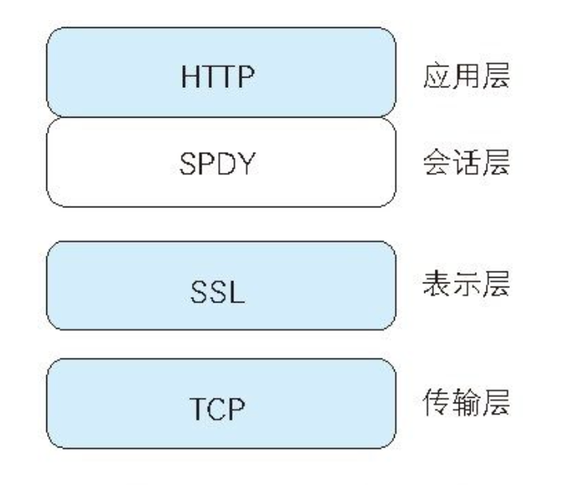

### WebSocket协议（真正的全双工）

为了彻底解决Ajax和Comet在实时通信上的无力感，WebSocket诞生了。

- **核心特点**：
  1. **全双工通信**：一旦连接，服务器和客户端可以**随时、互发**数据。
  2. **开销极小**：建立连接后，数据帧头非常小（仅几个字节），不再有厚重的HTTP Header。
  3. **长连接**：连接一旦建立，除非手动关闭，否则一直保持。
- **握手流程（Handshaking）**：
  - 借用HTTP的 **101 Switching Protocols** 状态码。
  - 关键首部：`Upgrade: websocket` 和 `Connection: Upgrade`。
  - 安全校验：通过 `Sec-WebSocket-Key` 和 `Sec-WebSocket-Accept` 确认双方身份。
- **应用场景**：聊天室、实时游戏、股票K线图、协作编辑。

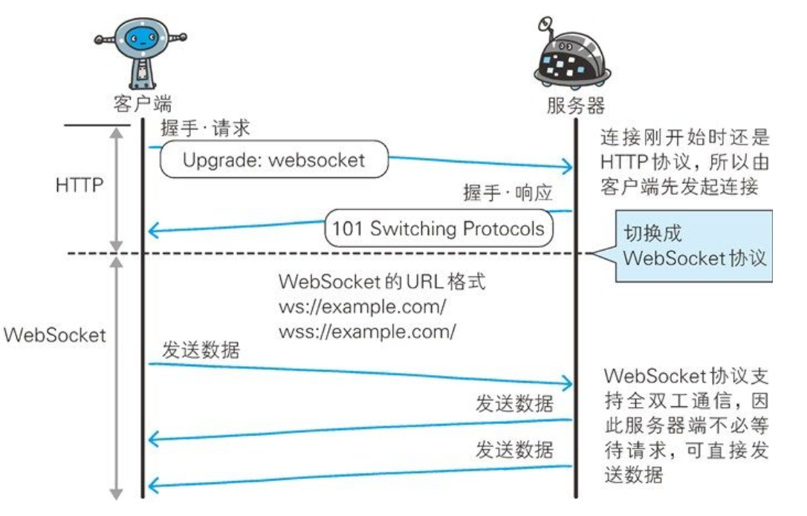

### HTTP/2.0

参考：[https://www.zhihu.com/question/34074946](https://www.zhihu.com/question/34074946)

- **多路复用**：允许同时通过单一的HTTP/2连接发起多重的**请求-响应**消息。
- **二进制分帧**：在应用层和传输层之间加了一个**二进制分帧层**：
  - **分帧**：将原本的Header和Body拆分成更小的、带编号的**帧（Frame）**。
  - **类型**：常见的有 **HEADERS帧**（存放首部）和 **DATA帧**（存放实体内容）。
- **首部压缩**：HTTP/1.1并不支持HTTP首部压缩，为此SPDY和HTTP/2应运而生，SPDY使用的是通用的压缩算法。

### HTTP/3：基于QUIC的进化

**它是如何实现的？**

- **彻底抛弃TCP**：HTTP/2虽然牛，但由于TCP协议的限制，一旦丢包，整个连接都会卡住（TCP队头阻塞）。
- **基于UDP（QUIC）**：HTTP/3改用Google开发的 **QUIC协议**（基于UDP改良），在传输层就解决了丢包阻塞问题。

## 第10章 Web攻击技术

简单的HTTP协议本身并不存在安全性问题，因此协议本身几乎不会成为攻击的对象。应用HTTP协议的服务器和客户端，以及运行在服务器上的Web应用等资源才是攻击目标。

HTTP不具备必要的安全功能，就拿远程登录时会用到的SSH协议来说，SSH具备协议级别的认证及会话管理等功能，HTTP协议则没有。另外在架设SSH服务方面，任何人都可以轻易地创建安全等级高的服务。而HTTP即使已假设好服务器，但开发者需要自行设计并开发认证及会话管理功能来满足Web应用的安全。而自行设计就意味着会出现各种形形色色的实现，可仍在运作的Web应用背后就会隐藏着各种容易被攻击者滥用的安全漏洞的Bug。

### 因输出值转义不完全引发的安全漏洞

- **跨站脚本攻击**：主要是指在用户浏览器内运行了非法的HTML标签或JavaScript脚本。比如富文本编辑器，如果不过滤用户输入的数据直接显示用户输入的HTML内容的话，就会有可能运行恶意的JavaScript脚本，导致页面结构错乱，Cookies信息被窃取等问题。
- **SQL注入攻击**：是指针对Web应用使用的数据库，通过运行非法的SQL而产生的攻击。
- **OS命令攻击**：是指通过Web应用，执行非法的操作系统命令达到攻击的目的。只要在能调用Shell函数的地方就有存在被攻击的风险。
- **HTTP首部注入攻击**：是指攻击者通过在响应首部字段内插入换行，添加任意响应首部或主体的一种攻击。
- **HTTP响应截断攻击**：是用在HTTP首部注入的一种攻击。攻击顺序相同，但是要将两个%0D%0A%0D%0A并排插入字符串后发送。利用两个连续的换行就可作出HTTP首部与主体分隔所需的空行了，这样就能显示伪造的主体，达到攻击的目的。
- **邮件首部注入攻击**：是指Web应用中的邮件发送功能，攻击者通过向邮件首部To或Subject内任意添加非法内容发起的攻击。利用存在安全漏洞的Web网站，可对任意邮件地址发送广告邮件或病毒邮件。
- **目录遍历攻击**：是指对本无意公开的文件目录，通过非法截断其目录路径后，达成访问目的的一种攻击。比如，通过../等相对路径定位到/etc/passwd等绝对路径上。
- **远程文件包含漏洞**：是指当部分脚本内容需要从其他文件读入时，攻击者利用指定外部服务器的URL充当依赖文件，让脚本读取之后，就可运行任意脚本的一种攻击。

### 因设置或设计上的缺陷引发的安全漏洞

- **强制浏览**：是指从安置在Web服务器的公开目录下的文件中，浏览那些原本非自愿公开的文件。比如，没有对那些需要保护的静态资源增加权限控制。
- **不正确的错误消息处理**：指Web应用的错误信息内包含对攻击者有用的信息。
- **开放重定向**：是一种对指定的任意URL作重定向跳转的功能。而于此功能相关联的安全漏洞是指，假如指定的重定向URL到某个具有恶意的Web网站，那么用户就会被诱导至那个Web网站。

### 因会话管理疏忽引发的安全漏洞

- **会话劫持**：是指攻击者通过某种手段拿到了用户的会话ID，并非法使用此会话ID伪装成用户，达到攻击的目的。
- **会话固定攻击（Session Fixation）**：对以窃取目标会话ID为主动攻击手段的会话劫持而言，会强制用户使用攻击者指定的会话ID，属于被动攻击。
- **跨站点请求伪造（Cross-Site Request Forgeries, CSRF）**：是指攻击者通过设置好陷阱，强制对已完成认证的用户进行非预期的个人信息或设定等某些状态更新，属于被动攻击。

### 其它安全漏洞

- **密码破解**：
  1. 通过网络进行密码试错（穷举法和字典攻击）；
  2. 对已加密密码的破解（通过穷举法·字典攻击进行类推、彩虹表、拿到加密时使用的密钥、加密算法的漏洞）。
- **点击劫持**：是指利用透明的按钮或链接做成陷阱，覆盖在Web页面之上。然后诱使用户在不知情的情况下，单击那个链接访问内容的一种攻击手段。这种行为又称为界面伪装（UI Redressing）。
- **Dos攻击**：是一种让运行中的服务呈停止状态的攻击。有时也叫做服务停止攻击或拒绝服务攻击。多台计算机发起的Dos攻击称为DDoS攻击（Distributed Denial of Service attack）。
- **后门程序**：是指开发设置的隐藏入口（如开发阶段作为Debug调用的后门程序），可不按正常步骤使用受限功能。利用后门程序就能够使用原本受限的功能。
